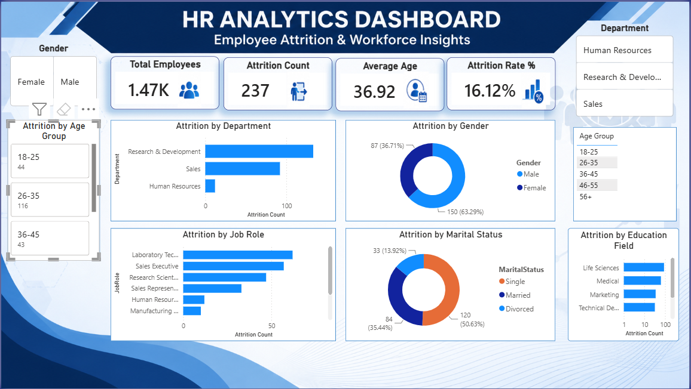

# HR Analytics Dashboard (Power BI)

## Overview

This interactive HR Analytics Dashboard was developed in Power BI to analyze employee attrition, workforce demographics, departmental performance, job roles, education fields, and employee trends.

The dashboard enables HR professionals and business stakeholders to identify attrition patterns, monitor workforce metrics, and make data-driven decisions to improve employee retention.

---

## Business Problem

Employee attrition is a critical challenge for organizations as it impacts productivity, recruitment costs, and workforce planning.

This dashboard helps answer key business questions such as:

* Which departments experience the highest attrition?
* Which employee groups are more likely to leave?
* How do age, gender, education, and marital status influence attrition?
* Which job roles require greater retention focus?

---

## Dashboard Preview

---

## Live Dashboard

🔗 **View Interactive Dashboard**

https://app.powerbi.com/view?r=eyJrIjoiYzgyMTdmYTctMjcwNS00NTQ1LTg4YjEtNTFhYTY2YTdkNTFjIiwidCI6ImU2YjE2Yjc3LTBkM2ItNDQyZi05NzU1LTMxNGI2MzZhN2E1OSJ9

---

## Key Metrics

| Metric          | Value  |
| --------------- | ------ |
| Total Employees | 1,470  |
| Attrition Count | 237    |
| Average Age     | 36.92  |
| Attrition Rate  | 16.12% |

---

## Dashboard Features

### Employee Overview

* Total Employees
* Attrition Count
* Average Age
* Attrition Rate %

### Attrition Analysis

* Attrition by Department
* Attrition by Gender
* Attrition by Job Role
* Attrition by Marital Status
* Attrition by Age Group
* Attrition by Education Field

### Interactive Filters

* Gender Filter
* Department Filter
* Age Group Filter

---

## Skills Demonstrated

* Data Cleaning & Transformation
* Power Query
* Data Modeling
* DAX Measures
* KPI Development
* HR Analytics
* Interactive Dashboard Design
* Business Intelligence Reporting
* Data Visualization

---

## Key Findings

* Research & Development department recorded the highest attrition.
* Employees aged 26–35 experienced the highest turnover.
* Male employees showed higher attrition than female employees.
* Sales Executive and Laboratory Technician roles contributed significantly to attrition.
* Single employees experienced higher attrition compared to married employees.

---

## Tools & Technologies

* Power BI
* DAX
* Power Query
* Microsoft Excel

---

## Project Outcome

The dashboard provides actionable insights into workforce behavior and employee turnover patterns. It enables HR teams to identify risk areas, improve retention strategies, and support data-driven workforce planning.

---

### Repository Contents

* HR-Analytics-Dashboard.pbix
* HR-Analytics-Dashboard-Image.png
* README.md
